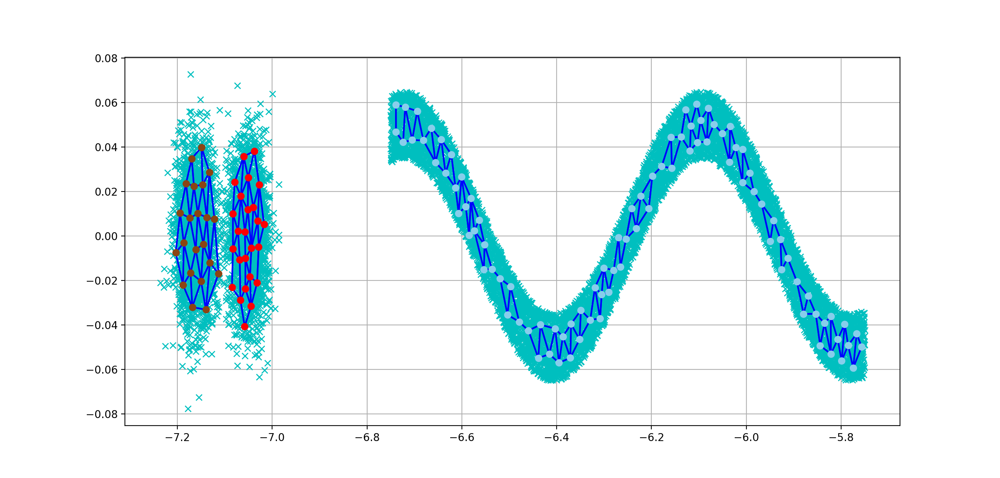

# ESoinn
Enhanced Self-Organizing Incremental Neural Network implementation with Python

Based on https://github.com/nkmry/soinn

Execute demo.py to run the demo.

Result of 3 classes classification

